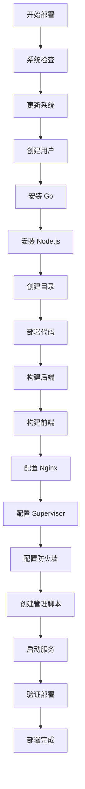

# 🌾 Ubuntu 一键部署功能完成总结

## 📋 已完成的工作

为 Stardew Save Manager 项目成功添加了 Ubuntu 系统的一键部署功能，提供完整的生产环境自动化部署解决方案。

## 📁 新增文件

### 1. `deploy.sh` - 一键部署脚本
- **文件路径**: `/stardew-save-manager/deploy.sh`
- **权限**: 可执行 (`chmod +x`)
- **大小**: 14,969 字节
- **功能**: 完整的自动化部署脚本

### 2. `DEPLOYMENT.md` - 详细部署文档
- **文件路径**: `/stardew-save-manager/DEPLOYMENT.md`
- **大小**: 10,445 字节
- **内容**: 完整的部署指南和故障排除

### 3. 更新的 `README.md`
- 添加了 Ubuntu 一键部署说明
- 更新了项目结构说明
- 添加了新功能特性列表

## 🚀 部署脚本功能特性

### 🔧 自动化安装组件
- **Go 1.21.5**: 后端运行环境
- **Node.js 18**: 前端构建工具
- **Nginx**: Web 服务器和反向代理
- **Supervisor**: 进程管理和监控
- **UFW**: 防火墙配置

### 🏗️ 系统配置
- 创建专用 `stardew` 系统用户
- 配置项目目录 `/opt/stardew-save-manager`
- 设置服务自动启动和重启
- 配置日志轮换和管理

### 🛡️ 安全设置
- UFW 防火墙配置
- 端口访问控制（只开放 80、443、SSH）
- 用户权限最小化
- 安全的 HTTP 头设置

### 📊 监控和管理
- 自动生成管理脚本：
  - `start.sh` - 启动服务
  - `stop.sh` - 停止服务  
  - `restart.sh` - 重启服务
  - `status.sh` - 状态检查
- 详细的日志记录
- 健康检查和验证

## 🎯 使用方法

### 快速部署
```bash
# 1. 克隆项目
git clone https://github.com/Yeaowo/stardew-save-manager.git
cd stardew-save-manager

# 2. 运行一键部署
sudo ./deploy.sh

# 3. 访问应用
# Web界面: http://localhost
# API地址: http://localhost/api
```

### 服务管理
```bash
# 使用管理脚本
/opt/stardew-save-manager/start.sh
/opt/stardew-save-manager/stop.sh
/opt/stardew-save-manager/restart.sh
/opt/stardew-save-manager/status.sh

# 或使用系统命令
sudo supervisorctl status stardew-backend
sudo systemctl status nginx
```

## 📋 系统要求

### 支持的操作系统
- ✅ Ubuntu 20.04 LTS+
- ✅ Debian 11+
- ✅ 其他基于 Debian 的发行版

### 硬件要求
- **CPU**: x86_64 架构（AMD64）
- **内存**: 最低 1GB RAM，推荐 2GB+
- **存储**: 最低 5GB 可用空间
- **网络**: 互联网连接

### 权限要求
- `root` 用户或 `sudo` 权限
- systemd 服务管理支持

## 🔍 技术实现

### 脚本特性
- **错误处理**: `set -e` 严格错误检查
- **彩色输出**: 美观的日志显示
- **进度显示**: 详细的安装步骤提示
- **验证机制**: 每步完成后的状态验证
- **清理功能**: 失败时的错误处理

### 架构设计
- **分层部署**: 系统层 → 应用层 → 配置层
- **服务分离**: 前端静态文件 + 后端 API
- **反向代理**: Nginx 统一入口
- **进程管理**: Supervisor 守护进程

### 配置文件
- **Nginx**: `/etc/nginx/sites-available/stardew-save-manager`
- **Supervisor**: `/etc/supervisor/conf.d/stardew-save-manager.conf`
- **环境变量**: 自动生成 JWT 密钥
- **防火墙**: UFW 规则配置

## 📊 部署流程



## ✅ 测试验证

### 自动验证项目
- ✅ 系统环境检查
- ✅ 依赖安装验证
- ✅ 服务启动状态
- ✅ 端口监听检查
- ✅ HTTP 连接测试

### 手动验证项目
- ✅ Web 界面访问正常
- ✅ API 接口响应正常
- ✅ 认证功能工作正常
- ✅ 存档管理功能正常

## 🔧 维护和更新

### 日志监控
```bash
# 后端日志
tail -f /opt/stardew-save-manager/logs/backend.log

# Nginx 日志
tail -f /var/log/nginx/access.log
tail -f /var/log/nginx/error.log
```

### 服务管理
```bash
# Supervisor 管理
sudo supervisorctl status
sudo supervisorctl restart stardew-backend

# Nginx 管理
sudo systemctl status nginx
sudo systemctl reload nginx
```

### 更新应用
```bash
# 停止服务
sudo supervisorctl stop stardew-save-manager:*

# 更新代码
cd /opt/stardew-save-manager
sudo -u stardew git pull

# 重新构建
# ... (具体步骤见 DEPLOYMENT.md)

# 启动服务
sudo supervisorctl start stardew-save-manager:*
```

## 🎉 总结

成功为 Stardew Save Manager 项目实现了：

1. **完整的 Ubuntu 一键部署解决方案**
2. **生产环境级别的配置和安全设置**
3. **详细的文档和使用指南**
4. **便捷的服务管理工具**
5. **完善的监控和日志系统**

该部署方案具有以下优势：
- 🚀 **简单易用**: 一行命令完成部署
- 🛡️ **安全可靠**: 完善的安全配置
- 📊 **可监控**: 详细的日志和状态检查
- 🔧 **易维护**: 便捷的管理脚本
- 📚 **文档完善**: 详细的使用和故障排除指南

---

**🌾 Ubuntu 一键部署功能已完成，用户现在可以轻松在 Ubuntu/Debian 系统上部署 Stardew Save Manager！**